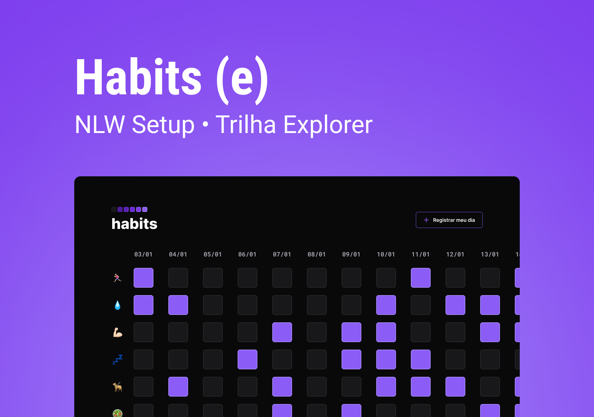

<h1 align="center"> Habits - NLW setup</h1>

 Esse é um projeto da trilha explore desenvolvido no evento da rocketseat, a NLW 

 

[Acesse o projeto aqui!](https://gabriel-vitebo.github.io/habits-NLW-explore/)

## Como funciona o Habits?
- É um app para ajudar a rastrear os hábitos.

- ao clicar no botão "Registrar meu dia", ou, dependendo do tamanho da sua tela, no botão com o sinal de "+", irá registrar o dia de hoje.

- após registrar o dia, clique nos hábitos que você fez nesse dia.

- o dia ficará salvo no seu navegador, podendo atualizar a página sem medo de perde os registros.

## Tecnologias 💻
- HTML 
- CSS
- JavaScript
- Git e Github

## Contato 💌

vitebo@outlook.com 
